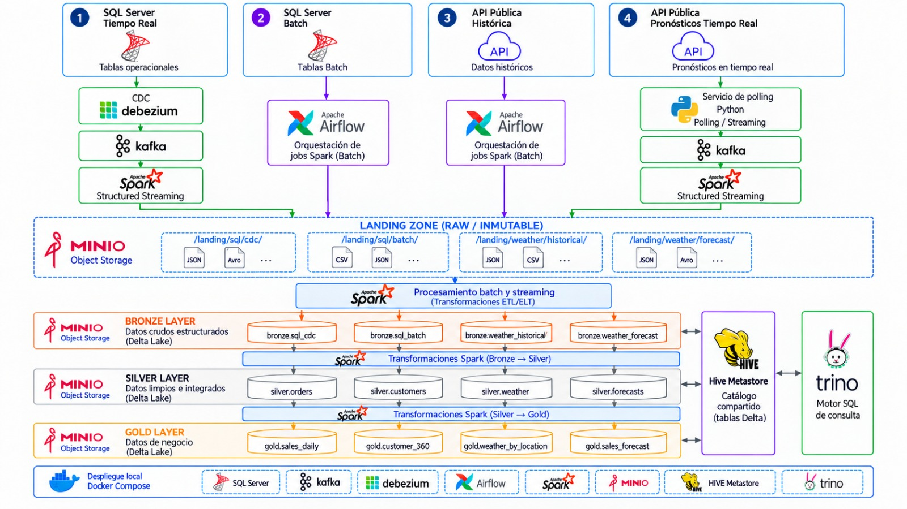

# GridPredic Infra

Entorno local de desarrollo para ejecutar la plataforma de datos de GridPredic con Docker Compose.

## Estructura del repositorio

- `services/`: Dockerfiles, configuraciones y scripts de cada servicio. Los backups locales se guardan en `services/sqlserver/backups/` y los archivos `.bak` se excluyen de Git.
- `pipelines/dags/`: DAGs de Airflow.
- `pipelines/config/`: configuración de los pipelines.
- `pipelines/jobs/`: jobs Spark organizados por capas (`00_landing`, `01_bronze` y `02_silver`).
- `docs/`: documentación y diagrama de arquitectura.
- `compose.yaml`: definición del entorno local y sus montajes.

Los DAGs, configuraciones y jobs se agrupan por capa de destino. Los archivos siguen la convención `<tipo>_<capa>_<origen o entidad>[_<batch|streaming>].<extensión>`:

- `dag_bronze_sqlserver.py`: orquestación de la carga Bronze de SQL Server.
- `config_bronze_sqlserver.json`: configuración de esa carga.
- `job_bronze_sqlserver_batch.py`: job batch que realiza la ingesta.
- `job_silver_d_salidas.py`: job batch que transforma la entidad `d_salidas` y escribe la tabla `l2_silver.salidas`.

Landing y Bronze incluyen el origen; Silver y Gold, la entidad o resultado. Solo los jobs de Landing y Bronze incluyen el sufijo `batch` o `streaming`; los jobs de Silver y Gold no lo incluyen; los DAGs y configuraciones actuales corresponden a cargas batch. El DAG `pipelines/dags/01_bronze/dag_bronze_sqlserver.py` conserva su identificador de Airflow `ingest_sqlserver_batch_bronze`.

## Flujo de datos



> El diagrama representa la arquitectura objetivo. Actualmente este repositorio implementa la ingesta de SQL Server en batch y streaming hasta Bronze, además de un ejemplo de transformación Silver.

## Stack tecnológico

| Área | Tecnología | Función |
| --- | --- | --- |
| Fuentes | **SQL Server 2022** | Bases de datos operacionales y fuentes batch |
| CDC y mensajería | **Debezium, Kafka, Kafka Connect** | Captura y transporte de cambios en tiempo real |
| Orquestación | **Apache Airflow** | Orquestación de las cargas batch |
| Procesamiento | **Apache Spark 4 + Delta Lake** | Ingesta streaming/batch y transformaciones Bronze → Silver → Gold |
| Almacenamiento | **MinIO** | Object Storage compatible con S3 para Landing y Delta Lake |
| Catálogo | **Hive Metastore + PostgreSQL** | Catálogo compartido de las tablas Delta |
| Consulta | **Trino** | Motor SQL sobre el lakehouse |
| Operación | **Kafka UI + Spark History Server** | Inspección de Kafka y ejecuciones Spark |

---

## 1. Requisitos mínimos del ordenador

Para ejecutar todo el stack localmente:

- **CPU:** 4 cores.
- **RAM:** 16 GB.
- **Disco libre:** al menos **120 GB**. Los cuatro backups ocupan aproximadamente **61,4 GB** y las bases restauradas requieren espacio adicional.

Se recomienda asignar a Docker Desktop al menos **4 CPU y 12 GB de RAM**.

---

## 2. Software necesario

Instalar únicamente:

- **Git**
- **Docker Desktop**
- **Docker Compose >= 2.30.0** (`docker compose`)

Comprobación rápida:

```bash
git --version
docker --version
docker compose version
```

---

## 3. Clonar el repositorio

```bash
git clone https://github.com/antonpolenyaka/gridpredic-infrastructure.git
cd gridpredic-infrastructure
```

Todos los comandos siguientes se ejecutan desde la raíz del repositorio.

---

## 4. Añadir los backups de SQL Server

Crear, si no existe, la carpeta:

```text
services/sqlserver/backups/
```

Copiar dentro los cuatro backups con estos nombres exactos:

```text
Calser_DIST_1_14082026.bak
Calser_DIST_2_14082026.bak
Calser_DIST_3_14082026.bak
TedisNet_EOSA_backup_2026_08_14_020001_2902307.bak
```

Durante el arranque se restauran como:

| Backup | Base de datos |
| --- | --- |
| `Calser_DIST_1_14082026.bak` | `Calser_EOSA` |
| `Calser_DIST_2_14082026.bak` | `Calser_Pitarch` |
| `Calser_DIST_3_14082026.bak` | `Calser_ValleSantaAna` |
| `TedisNet_EOSA_backup_2026_08_14_020001_2902307.bak` | `TedisNet_EOSA` |

---

## 5. Crear el archivo `.env`

Duplicar `.env.example` como `.env`:

```bash
cp .env.example .env
```

Y configurar las credenciales locales:

```dotenv
HIVE_METASTORE_DB_PASSWORD=<PASSWORD>
MINIO_ROOT_USER=<USER>
MINIO_ROOT_PASSWORD=<PASSWORD>
MSSQL_SA_PASSWORD=<PASSWORD>
```

`MSSQL_SA_PASSWORD` debe cumplir la política de complejidad de SQL Server.

---

## 6. Levantar la infraestructura

```bash
docker compose up -d --build --wait
```

Los `healthchecks` y las dependencias del Compose controlan el orden de inicialización. Cuando el comando termina correctamente, el entorno está listo para utilizarse.

El primer arranque puede tardar varios minutos mientras se construyen las imágenes, se restauran las bases de datos y Spark resuelve sus dependencias iniciales.

Durante el arranque se realiza automáticamente:

- construcción de las imágenes locales de **Spark**, **Hive** y **Airflow**;
- creación de los buckets `datalake` y `spark-events` en **MinIO**;
- arranque de **PostgreSQL** y **Hive Metastore**;
- creación de los schemas `l1_bronze`, `l2_silver` y `l3_gold`;
- restauración de las cuatro bases de datos en **SQL Server**;
- activación de **CDC** sobre las tablas configuradas de `TedisNet_EOSA`;
- arranque de **Kafka** y registro del conector `tedisnet-eosa-connector` en **Kafka Connect**;
- arranque del clúster **Spark**, **Airflow**, **Trino**, **Kafka UI** y **Spark History Server**.

---

## 7. Puertos y herramientas de acceso

| Servicio | Dirección | Uso |
| --- | --- | --- |
| SQL Server | `localhost:1433` | Acceso a las cuatro bases de datos |
| Spark Master | http://localhost:8080 | Estado del clúster Spark |
| Spark Worker | http://localhost:8081 | Estado del worker Spark |
| Kafka UI | http://localhost:8082 | Topics, mensajes y estado de Kafka Connect |
| Airflow | http://localhost:8084 | Gestión y ejecución de DAGs |
| Trino | http://localhost:8085 | Endpoint/UI del motor SQL |
| MinIO Console | http://localhost:9001 | Navegación por buckets y objetos |
| Spark History Server | http://localhost:18080 | Histórico de aplicaciones Spark |

### SQL Server — SSMS

Conectar con **SQL Server Management Studio (SSMS)**:

```text
Server: localhost,1433
Authentication: SQL Server Authentication
Login: sa
Password: <valor de MSSQL_SA_PASSWORD>
```

### Trino — DBeaver

Crear una conexión **Trino** en DBeaver:

```text
Host: localhost
Port: 8085
Database/Schema: lakehouse
Username <cualquier valor>
```

No hay autenticación por contraseña configurada para Trino en este entorno local.

### MinIO

Acceder a `http://localhost:9001` con `MINIO_ROOT_USER` y `MINIO_ROOT_PASSWORD`.

### Airflow

Acceder a `http://localhost:8084` con:

```text
User: admin
Password: generada automáticamente por Airflow en el primer arranque
```

Para consultar la contraseña:

```bash
docker compose exec airflow cat /opt/airflow/simple_auth_manager_passwords.json.generated
```

---

## 8. Ejecutar los jobs de streaming

Los dos jobs son procesos continuos, por lo que conviene ejecutarlos en **dos terminales diferentes**.

### 8.1 Landing

En la primera terminal:

```bash
docker compose exec spark-master \
  spark-submit \
  /app/jobs/00_landing/job_landing_sqlserver_streaming.py
```

El job consume los eventos CDC de Kafka y los persiste como Parquet en:

```text
s3a://datalake/00_landing/tedisnet-eosa
```

### 8.2 Bronze

**No arrancar Bronze inmediatamente.** Su esquema se obtiene leyendo los ficheros ya existentes en Landing.

Cuando Landing haya escrito al menos los primeros ficheros Parquet —puede comprobarse desde la consola de MinIO—, abrir una segunda terminal y ejecutar:

```bash
docker compose exec spark-master \
  spark-submit \
  /app/jobs/01_bronze/job_bronze_sqlserver_streaming.py
```

Este job procesa los eventos CDC de Landing y mantiene las tablas Delta correspondientes en `l1_bronze`.

---

## 9. Ejecutar el DAG batch de Airflow

Abrir:

```text
http://localhost:8084
```

Y ejecutar manualmente el DAG:

```text
ingest_sqlserver_batch_bronze
```

El DAG lanza los jobs Spark que extraen las tablas batch configuradas en `pipelines/config/01_bronze/config_bronze_sqlserver.json` y las cargan como tablas Delta en `l1_bronze`.

---

## 10. Ejemplo de transformación Silver: `salidas`

Una vez completado correctamente el DAG batch, puede ejecutarse la transformación de ejemplo `job_silver_d_salidas.py`:

```bash
docker compose exec spark-master \
  spark-submit \
  /app/jobs/02_silver/job_silver_d_salidas.py
```

El job integra las tablas `salidas` de las tres bases Calser y genera:

```text
l2_silver.salidas
```

Puede comprobarse desde Trino/DBeaver, por ejemplo:

```sql
SELECT *
FROM lakehouse.l2_silver.salidas
LIMIT 100;
```
